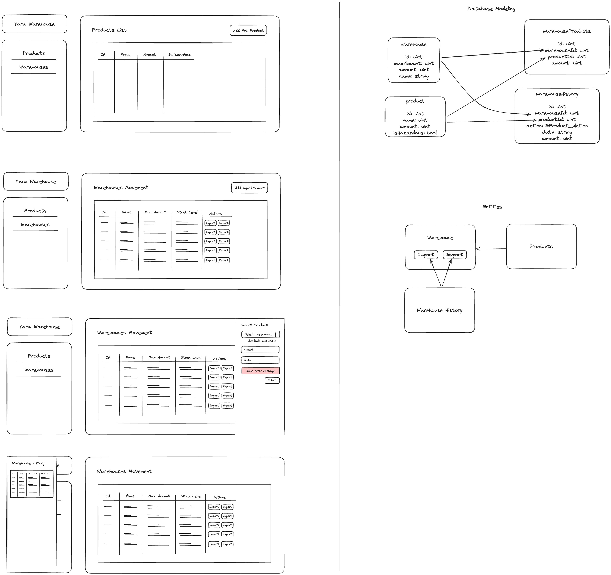

# Yara Warehouses Client

This is the frontend repo for the **Yara Warehouses Application**. You can find a detailed diagram about how it works and what is the database modeling behind it by [clicking here](https://excalidraw.com/#json=5Q7IYSqHkzG5wYdwFWFef,LOQuzSuH0RqudjMNmjLVEg) or looking to this image bellow: 

 

You can find the GraphQL API playground here: https://yara-stock-service.onrender.com/graphql

## Running the app
In order to run the app, first run `npm install`.

After that, you can just run `npm run dev` on your terminal, and after the server is up, you can open the browser by accessing: `http://localhost:5173/`